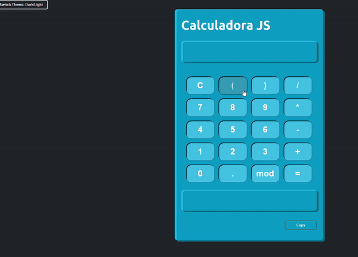

# CALCULADORA JS

## Description

Calculadora desenvolvida em HTML, CSS e Javascript.

Foram aplicados conhecimentos em Dom, importação e exportação de módulos e funções.

Funcionalidades extra: copiar resultado com o botão copy e alternar tema.

  

